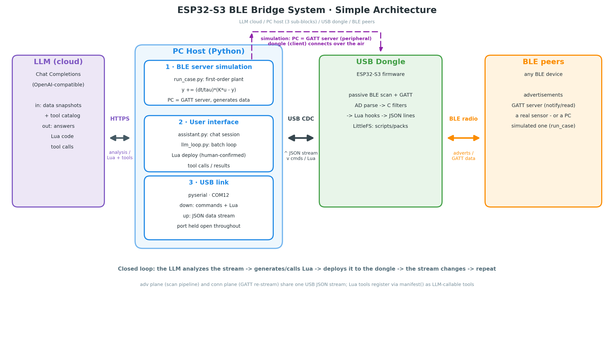
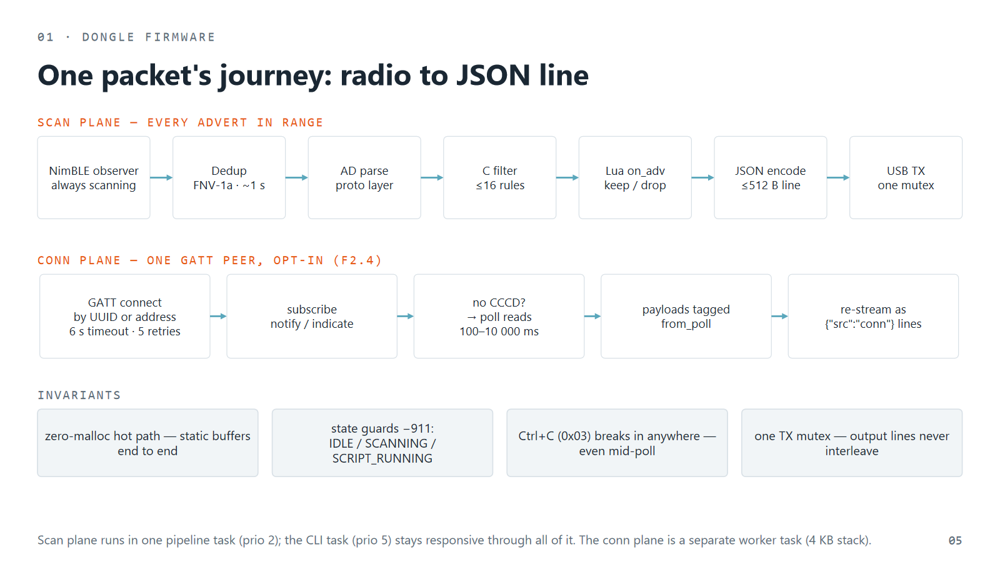
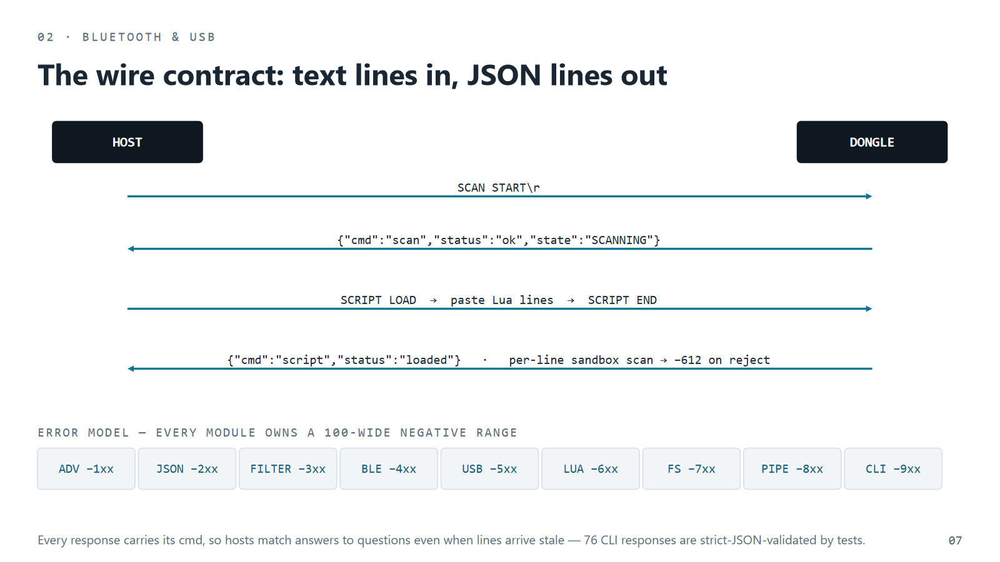
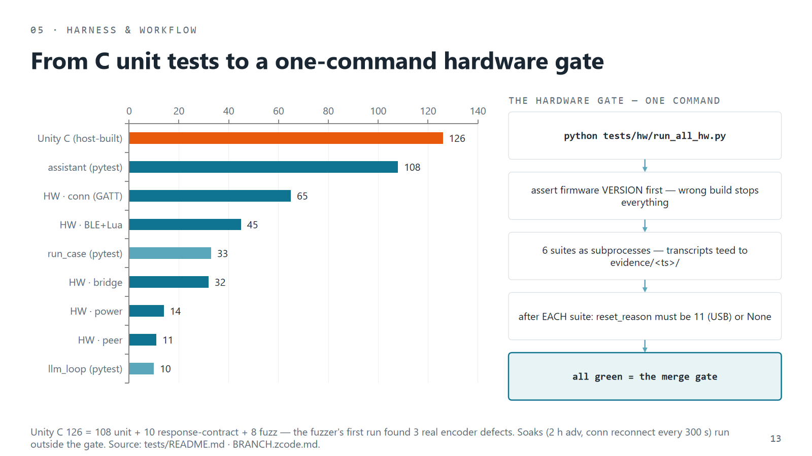
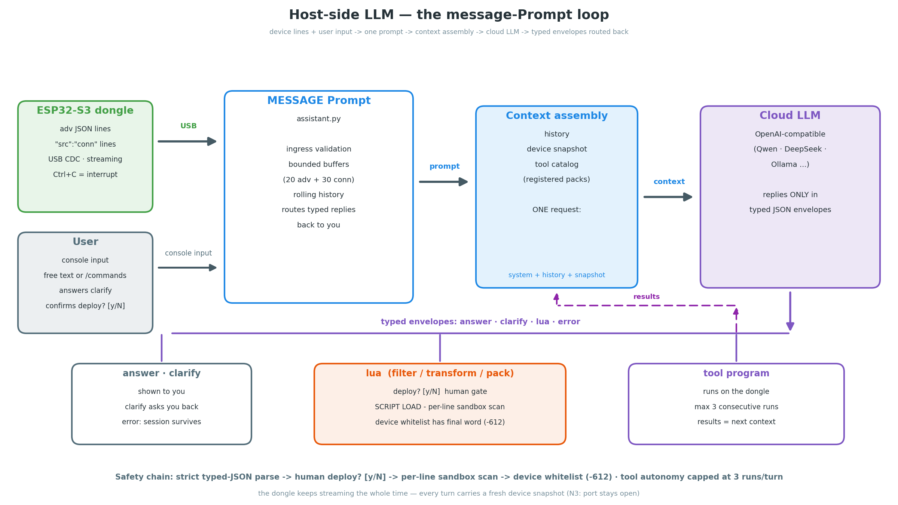
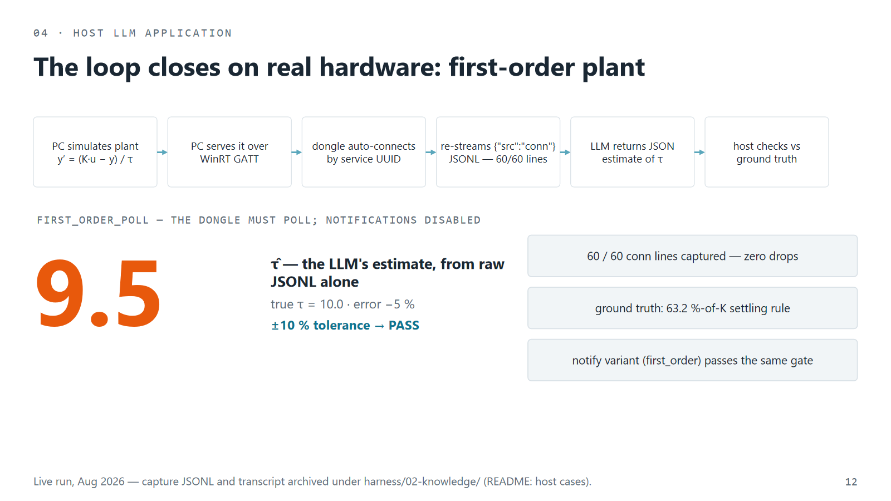
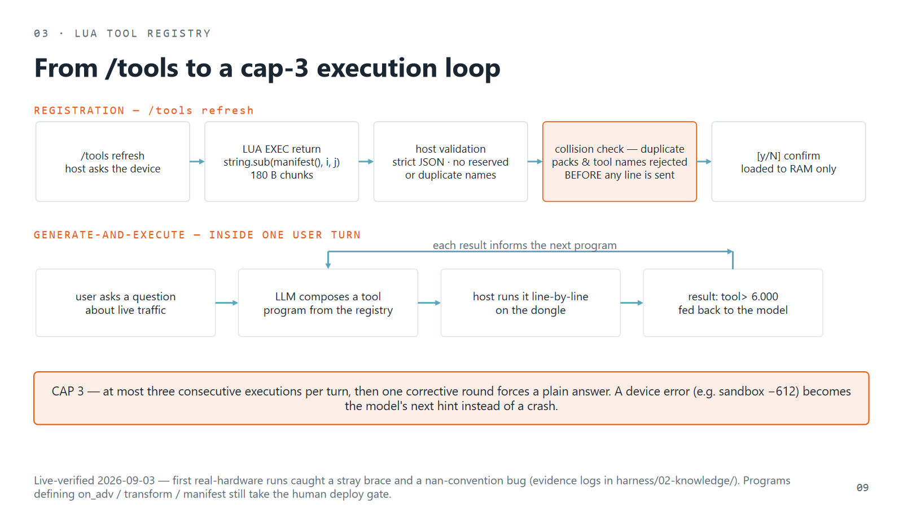

# ESP32-S3 BLE Bridge Dongle

A USB dongle that bridges BLE devices and a cloud LLM through your PC. The
dongle connects to the BLE world — GATT connections plus advertisement
collection — parses and filters the data (with optional on-device Lua), and
streams structured JSON lines to the host over USB CDC. The host
post-processes the stream, enriching it with semantics; an LLM reads it,
answers you, and writes Lua that is deployed back to the dongle — closing
the loop: device → dongle → PC → LLM → device. In a live session three
participants do the work — the dongle collects, the PC post-processes the
stream into semantics, the LLM decides and writes the code — and you steer
them.



*The system in one picture: your BLE device talks to the LLM through this chain — data flows up over the dongle's radio, the LLM's Lua flows back down the same path.*

## Status: v1.1.0 — stages 1–6 complete ✅

- **The whole loop is implemented and hardware-verified**: 13 v1 firmware
  features + F2.4 GATT-connection plane + stage-5 host tooling + the H6.1
  **Lua tool registry** (tool packs with flash persistence + boot autorun,
  `hw.*` device bindings, mutating-tool gate, native tool-calling)
- **Identity**: the build target is `ble_bridge` (`ble_bridge.bin`), the
  over-air device name is `BLE-Bridge` — a BLE *bridge*, not a monitor:
  the device's data reaches the LLM and the LLM's Lua reaches back
- **Verified 2026-09-29 on this exact firmware**: Unity host suite
  **160/0** · python **153 + 35 + 10** · hardware gate **6/6** suites
  (conn **65/0**, BLE+Lua **45/0**, bridge **32/0**, power **14/0**, plus
  CR/LF + terminal-sim contract runs) · packs **25/0** (survives reboot,
  autorun proof) · hwio **22/0** (kv store survives reboot) · peer
  **11/0** → **203 checks, 0 failures**. Transcripts:
  `harness/02-knowledge/evidence-hw-runs/`
- New here? `docs/quickstart.md` is the 10-minute path; per-feature specs
  live in `harness/01-features/` (`stage5-host/`, `stage6-agent/`)

## Architecture

<!-- chart-id: CH-readme-01 rev1 -->
```
                            HOST PC
 +---------------------------------------------------------------------+
 |  collector / LLM tooling                test suites                  |
 |  - reads JSON adv lines                 - pyserial CLI drivers       |
 |  - analyzes, generates Lua              - bleak/WinRT controlled     |
 |  - SCRIPT LOAD upload                     BLE peer (PC advertises)   |
 +-------------------------- USB CDC (USB-Serial/JTAG) ----------------+
                    |   in: text commands (CR or LF; Ctrl+C = interrupt)
                    |   out: JSON lines (adv stream + command responses)
                    v
                            ESP32-S3 DONGLE
   NimBLE observer — passive, continuous discovery (BLE_HS_FOREVER)
        |  adv report: addr / addr_type / rssi / AD data / ts_ms
        v
   dedup (FNV-1a hash, ~1 s window, spinlock)  -->  raw ADV queue
        v
   pipeline task:
     AD parse (proto) -> C filter engine -> [Lua on_adv hook: keep/drop]
        v
     JSON encode (all dynamic text escaped) -> [Lua transform hook]
        v
     USB console TX (mutex-serialized lines)
```

Product loop (the reason the device exists): BLE data in → JSON out → the
host post-processes and adds semantics → the LLM analyzes and writes a Lua
filter/transform → `SCRIPT LOAD` deploys it (sandboxed) → the dongle acts on
the device with only what matters. The advertisement-scan core stays
scan-only; since F2.4 an optional, build-flagged GATT-client connection can
additionally attach to one peer and re-stream its notifications as
`"src":"conn"` lines.



*Every advertisement walks this pipeline left to right; the second row is the optional GATT connection plane that turns the dongle from observer into client.*

### Firmware modules (`firmware/components/`, public APIs in `interfaces/`)

| Module | Component | Role |
|--------|-----------|------|
| USB console | `usb` | USB-Serial/JTAG line I/O (IDF console, non-blocking read) |
| Storage | `storage` | LittleFS file store for Lua scripts |
| BLE | `ble` | NimBLE init, passive scan + FNV-1a dedup, pipeline task; optional GATT-client connection (F2.4, flag-gated) |
| Protocol | `proto`, `json_enc`, `filter` | AD parsing, JSON encoding, C filter rules |
| Lua | `lua` | Lua 5.4 on a static pool allocator, whitelist sandbox, hooks; script upload/run/stop |
| CLI | `cli` | Command parser + IDLE/SCANNING/SCRIPT_RUNNING state machine |
| Bridge | `bridge` | Text-line script upload with per-line sandbox scan |
| Power | `power` | Automatic light sleep when idle, PM activity lock while scanning or connected |

### Layer model (dependency rules)

```
Layer 4: cli                                  user-facing commands
Layer 3: scan_pipeline | ble_conn             orchestration / emission
Layer 2: filter | json_enc | lua | storage    services
Layer 1: ble_scan | usb | power               drivers / radio / PM
Layer 0: interfaces/*_if.h (proto types)      shared types & contracts
```

Upper layers depend on lower layers only — no reverse dependencies; the
CMake `REQUIRES` lists are the visible dependency graph. Cross-module data
flows through `interfaces/` types only (`coding_rules.md` §5).

### Threading model

| Task | Prio | Job |
|------|:----:|-----|
| NimBLE host | stack | GAP/GATT callbacks — scan callback *copies only*, conn callbacks *enqueue only* (radio never blocks) |
| pipeline | 2 | drains raw-ADV queue (32 deep, drops counted): parse → filter → Lua hooks → encode → USB |
| cli | 5 | reads USB lines, dispatches commands, owns the CLI state machine |
| ble_conn worker | 2 | drains conn payload queue (8 deep, drop-newest; notices evict-oldest); runs peer search/discovery/connect |

All USB output serializes on one TX mutex (100 ms take timeout) so lines
never interleave. Protection primitives: dedup spinlock, `lua_State`
mutex, filter-engine mutex, conn mutex + atomic state, and one
`NO_LIGHT_SLEEP` `esp_pm` lock shared by the scan and conn holders.

### Contracts at a glance



*The whole protocol: text lines in, JSON lines out — every response names the command it answers, and uploaded code is scanned per line, fail-closed.*
- **JSON line contract** — every machine-readable output is one ≤512 B
  JSON object per line; adv lines carry `ts/addr/type/rssi/name/uuids/manu/…`,
  conn lines add `"src":"conn"`. Host tools classify by key, not by order.
- **Error ranges** — each module owns a 100-wide negative range
  (`coding_rules.md` §1): ADV -1xx, JSON -2xx, FILTER -3xx, BLE -4xx
  (conn: named `BLE_CONN_ERR_*`, -450…-459), USB -5xx, LUA -6xx, FS -7xx,
  PIPE -8xx, CLI -9xx — parallel authors can't collide on codes.
- **Buffer table** — fixed sizes declared in the interface headers
  (USB RX 256 B, USB TX / JSON line 512 B, ADV raw 62 B, name 32 B,
  ≤16 filter rules); hot path is zero-malloc.
- **Byte order** — UUIDs, manufacturer IDs and MACs are big-endian hex
  strings everywhere (`"180A"`, `"004C"`, `"AA:BB:CC:DD:EE:FF"`).

### Memory model

Static allocation by rule: Lua runs on a 128 KB static pool
(`lua_pool.c` — 32-bit offsets, on-free coalescing, top-block shrink),
queues and line buffers are static, the encoder writes into a
pipeline-owned 512 B buffer; heap is left to libraries (cJSON, LittleFS,
NimBLE). `STATUS` exposes `free_heap` and `lua_pool{used,peak}` so pool
pressure is field-observable.

### Feature flags

| Flag | Where | Effect |
|------|-------|--------|
| `CONFIG_BLE_CONN_ENABLED` | `firmware/components/ble/Kconfig.projbuild` | compiles the F2.4 GATT client and selects `BT_NIMBLE_ROLE_CENTRAL`; off-build behaves like v1.0.0 |
| `CONFIG_BT_NIMBLE_MAX_CONNECTIONS=1` | `sdkconfig.defaults` | one connection by design |
| `CONFIG_LUA_HW_BINDINGS` | `firmware/components/lua/Kconfig.projbuild` | compiles the `hw.*` device bindings (GPIO whitelist, 12-bit ADC, kv configure-mode store) into the Lua API |
| `LUA_SOURCE` (CMake cache var) | `ble` component | conditional-dependency switch for the Lua implementation |

### Design highlights

- **State machine**: CLI enforces IDLE / SCANNING / SCRIPT_RUNNING with `-911` state guards
- **Continuous scan**: discovery runs with `BLE_HS_FOREVER` (no windowed
  restarts); `Ctrl+C` (0x03, no Enter) stops scan/script/upload instantly
- **Console contract**: CR, LF, and CRLF all terminate a line (PuTTY and
  scripts both work); overlong lines drain to end-of-line instead of
  leaking a re-parsed tail; every dynamic string in responses is JSON-escaped
- **Lua sandbox**: whitelist only (base/string/table/math/utf8, `string.dump` removed);
  uploads additionally scanned for `os.`/`io.`/`debug.`/`require`/etc. → reject `-612`
- **Concurrency**: `lua_State` mutex, dedup table spinlock, atomic scan state — all race findings from evaluations are fixed and regression-covered.
  The filter engine owns its own mutex and hook presence is cached at
  SCRIPT RUN/STOP, so the hot path takes no Lua-engine locks (2026-08-16)
- **Lua pool allocator**: extracted `lua_pool.c` — 32-bit offsets, on-free
  coalescing, top-block shrink, single ledger; host-tested incl. a >64 KB
  offset regression (2026-08-16 eval response)
- **Observability**: STATUS reports `reset_reason` (11 = USB reset on port
  close), `free_heap`, `lua_pool{used,peak}`, queue drops and pipeline counters
- **Power**: tickless light sleep when idle, wake-on-USB-command; a NO_LIGHT_SLEEP
  PM lock is held while scanning (console TX drops bytes if the SoC sleeps mid-stream)
- **Known hardware boundary (N3)**: closing the host COM port resets the
  chip (`ESP_RST_USB`) — host tools keep the port open (normal collector mode)

## Repository layout

```
firmware/components/   ESP-IDF components (one per module above)
interfaces/            Public C headers (*_if.h) — the only cross-module surface
main/                  app_main: init chain + USB command loop
tests/host/            Unity C host tests + python unit tests for the host
                       tools (test_assistant.py, test_run_case.py)
tests/harness/         (historical) on-target test sources, superseded by
                       tests/host + the HIL suites
harness/00-global-context/  product overview, coding rules, build env, git workflow
harness/01-features/   per-feature specs (13 v1 features + F2.4 + stage5-host/ + stage6-agent/)
harness/02-knowledge/  process reports + run-transcript evidence (per session)
harness/02-future/     v2+ spec space / promoted-feature notes
bug_check/             evaluations + fix reports (index: bug_check/README.md)
status/                session handoff reports (pointer: status/LATEST.md)
docs/                  proposals, reviews, quickstart, templates,
                       example LLM-generated Lua; docs/archive/ = history
.githooks/             commit-msg hook enforcing the 4-section standard
.qwen/                 local agent settings (gitignored): SessionStart hook

CMakeLists.txt         ESP-IDF project root (top-level)
sdkconfig.defaults     NimBLE observer+central roles, PM, console settings
partitions.csv         NVS / LittleFS / factory / storage layout

scripts/build.bat / flash.bat / monitor.bat  build · flash COM12 · console
scripts/dev_env.bat      idempotent tmux `esp32` build pane (WSL)
scripts/send_cmd.bat / h.bat  one-line command senders for manual sessions
llm_loop.py            host LLM loop (capture/analyze/deploy/loop, --dry-run)
host_app/run_case.py   H5.2 application-case runner (plant demo + --estimate)
host_app/assistant.py  H5.3 interactive LLM assistant session
host_app/tool_packs/   example Lua tool packs (demo.lua, hwio.lua)
article/               Medium article draft + figures (self-contained)
docs/diagrams/         diagram generators + EN/zh renders (PNG/SVG)
docs/img/              README figures (architecture, data flow, loops)
.llm_env               gitignored LLM credentials (KEY=value, local only)

tests/hw/test_bridge_hw.py  F4.1+F4.2 hardware suite (32 checks, pyserial on COM12)
tests/hw/test_power_hw.py   F4.3 hardware suite (14 checks)
tests/hw/test_ble_lua_hw.py BLE+Lua data-plane suite (45 checks, keeps port open)
tests/hw/test_ble_peer_hw.py controlled BLE peer suite (11 checks, bleak + WinRT)
tests/hw/test_pack_hw.py    H6.1 tool-pack suite (25 checks, reboot autorun proof)
tests/hw/test_hwio_hw.py    H6.1 hw.* suite (22 checks, kv-reboot proof)
tests/hw/test_ble_conn_hw.py F2.4 conn suite: C0 control plane (29) + C1-C6 WinRT
                       GATT-server tier (skips when the API is unavailable)
tests/hw/putty_sim_test.py  interactive-session simulation (CR endings, Ctrl+C)
tests/hw/cr_lf_test.py    line-terminator contract (CR / LF / CRLF)
tests/hw/capture_25s.py   25 s continuous-scan window check
tests/hw/soak_test.py     2 h H4 soak: scan + fragmenting transform + STATUS sampling
```

## Build & test

```bat
:: Host tests (PC, MinGW)
set PATH=C:\msys64\mingw64\bin;%PATH%
cmake -G "MinGW Makefiles" -S tests\host -B tests\host\build
cmake --build tests\host\build && tests\host\build\test_runner.exe

:: Host tests fallback: if cmake/MinGW fails on your box (the msys64 gcc
:: dies silently on this one), compile the suite directly with any gcc —
:: WSL Ubuntu works:
wsl -d Ubuntu -- bash -lc "cd /mnt/e/agent/esp32_lua_llm/tests/host && gcc -Wall -Wextra -Werror -DHOST_BUILD -I ../../interfaces -I ../third_party/unity/src -I . -I ../../firmware/components/proto -I ../../firmware/components/json_enc -I ../../firmware/components/filter -I ../../firmware/components/cli -I ../../firmware/components/bridge test_main.c test_adv_parser.c test_json_encoder.c test_filter_engine.c test_cli.c test_bridge.c test_lua_pool.c test_ble_conn.c ../../firmware/components/proto/proto_adv_parse.c ../../firmware/components/json_enc/json_encoder.c ../../firmware/components/filter/filter_engine.c ../../firmware/components/cli/cli_commands.c ../../firmware/components/bridge/lua_llm_bridge.c ../../firmware/components/lua/lua_pool.c test_stubs.c ../third_party/unity/src/unity.c -o /tmp/test_runner && /tmp/test_runner"

:: Firmware (ESP-IDF v5.1)
scripts/build.bat        :: full build
scripts/flash.bat        :: flash COM12
scripts/monitor.bat      :: USB-Serial/JTAG console

:: Hardware suites (device attached on COM12)
python tests/hw/test_bridge_hw.py
python tests/hw/test_power_hw.py
python tests/hw/test_ble_lua_hw.py COM12      :: BLE+Lua data plane (~90 s)
python tests/hw/test_ble_peer_hw.py COM12     :: controlled BLE peer, needs bleak+winrt (~60 s)
python tests/hw/test_ble_conn_hw.py           :: F2.4 CONN C0 + C1-C6 GATT tier (~60-120 s)

:: Feature-off build proof (F2.4): separate config + build dir
:: (copy sdkconfig to sdkconfig.off, unset BLE_CONN_ENABLED and
::  BT_NIMBLE_ROLE_CENTRAL, then:)
idf.py -B build_off -D SDKCONFIG=sdkconfig.off build
```

Note: after changing `sdkconfig.defaults`, delete `sdkconfig` and `build/` for a clean rebuild.

### Build workflow: the tmux `esp32` pane

Builds/flashes run in a dedicated tmux pane (WSL tmux, session `esp32`) so
long output streams in its own window instead of flooding the console/agent
context. `scripts/dev_env.bat` creates the pane idempotently and is wired to run
automatically at Qwen Code session start (`.qwen/settings.json`
SessionStart hook; run `scripts/dev_env.bat` by hand otherwise).

```bat
:: send a build into the pane with a sentinel, then poll for the sentinel
wsl -d Ubuntu tmux send-keys -t esp32:0.0 "cmd.exe /c \"scripts/build.bat > build_check.txt 2>&1 && echo BUILD_OK || echo BUILD_FAILED\"; echo SENTINEL" Enter
:: watch it live:  wsl -d Ubuntu tmux attach -t esp32   (detach: Ctrl-b d)
```

Read results from the log file tail (`build_check.txt`), never by dumping
the whole log into the conversation. Gotcha: never launch the WindowsApps
`pwsh.exe` shim from WSL interop — it kills the WSL instance and takes the
tmux server down (the pane defaults to bash for this reason; the real
PowerShell 7 binary is used when present).

### Commit message standard (enforced)

Every commit needs a `type(scope): summary` subject plus four filled
sections: `## What Changed`, `## Why (Decision/Rationale)`,
`## How (Process)`, `## Verification`. The `commit-msg` hook in
`.githooks/` rejects anything less — enable it once per clone:

```bat
git config core.hooksPath .githooks
```

Genuine exceptions bypass with `git commit --no-verify`.

## How to use (guided tour)

### Prerequisites

- ESP-IDF **v5.1** (`C:\Espressif`); the `scripts/*.bat` wrappers activate it
- Python 3 + `pyserial` (all suites); `winrt-*` packages for the
  controlled-peer and conn GATT tiers; a Windows BT adapter for WinRT
- Dongle on **COM12** (USB-Serial/JTAG, 115200)

### First five minutes

1. `scripts/build.bat` → `scripts/flash.bat` → `scripts/monitor.bat` (or PuTTY: serial 115200 with
   *Implicit CR in every LF* enabled for clean echoing).
2. `STATUS` → `{"status":"ok",…,"state":"idle",…}`.
3. `SCAN START` → advertisements stream as JSON lines; watch `ts` advance.
4. `Ctrl+C` (no Enter) → scan stops instantly; `POWER STATUS` shows the
   sleep estimate once idle.

### Filter and script by hand

```
FILTER ADD NAME Sensor_*      :: wildcard name rule
FILTER ADD RSSI -70           :: AND-combined with the name rule
SCAN START                    :: only matching devices stream now
FILTER LIST / FILTER CLEAR

SCRIPT LOAD                   :: paste Lua lines, finish with SCRIPT END
SCRIPT RUN                    :: on_adv/transform hooks join the pipeline
SCRIPT STOP
```

Rules: AND between filter types, OR within a type, ≤16 rules, empty set
passes all. Lua hooks get `on_adv(addr, addr_type, rssi, name, uuids,
manu_id, manu_data) -> bool` and `transform(addr, json_string) -> string`;
sandbox is whitelist-only (`string/table/math/utf8`).

### Connect to a device (F2.4, optional build)

```
CONN TARGET 12345678-1234-1234-1234-123456789abc [char-uuid]
CONN START                          :: auto-connect by advertised service UUID
CONN START AA:BB:CC:DD:EE:FF random :: or direct, with address type
CONN STATUS                         :: state/addr/mode/counters/mtu
CONN INTERVAL 500                   :: poll-fallback period (100..10000)
CONN STOP
```

Notifications (or polls) of the target characteristic re-stream as
`"src":"conn"` lines on the same USB stream; envelope keys (`ts/addr/src`)
win on payload collisions, oversized payloads are wrapped with
`"trunc":true`. A phone running nRF Connect as a GATT server is the
quickest manual peer (runbook in
`harness/01-features/stage2-ble-core/feature_ble_conn.md`).

### Define tools the LLM can call (H6.1 tool registry)

```
PACK BEGIN mytools [autorun]   :: store a tool pack in flash
PACK END                       :: (optional) autorun = tools alive on every boot
PACK LIST / PACK LOAD / PACK DEL
LUA BEGIN                      :: run a multi-line Lua chunk (<=4 KB) now
LUA END
```

A *tool pack* is a plain Lua file where every line is one complete statement
(<=240 bytes, so it rides the single-line transport), every tool takes ONE
table argument and returns a string, and a `manifest()` function advertises
the API. Load one from the assistant with `/tools load demo.lua` — done,
callable by you and by the model. `hw.*` bindings (GPIO write/read, 12-bit
ADC, a persistent kv store that survives reboots) let packs touch hardware.

### The LLM loop (one command)

```
python llm_loop.py COM12 loop --secs 8 --goal "keep only my Sensor_* devices"
```

capture → LLM writes Lua → `SCRIPT LOAD` deploy → verify the cleaned
stream. `--dry-run` needs no API key; credentials live in `.llm_env`
(gitignored). See *Host tooling* below for the subcommands. For a
conversation instead of a one-shot, run
`python host_app/assistant.py COM12` — ask questions about the live
data, answer the LLM's clarifying questions, confirm deploys by hand.
To see the connection plane proven with checkable numbers, run the
plant demo (H5.2): `python host_app/run_case.py COM12 --case
first_order --estimate` — the PC streams a first-order plant over GATT,
the dongle re-streams it, and the LLM's τ estimate is checked against
the configured ground truth.

### Troubleshooting

| Symptom | Cause / fix |
|---------|-------------|
| Chip reboots when the terminal closes | N3: closing COM12 resets the chip (`ESP_RST_USB`). Keep the port open; `STATUS` `reset_reason` 11 confirms |
| `Could not open COM12` | another owner holds the port (PuTTY or a suite) — one program at a time |
| Garbled echo in PuTTY | enable *Implicit CR in every LF* |
| Host suite won't configure | MinGW broken on some boxes; compile `tests/host` directly with any gcc (WSL gcc works) |
| `CONN START` times out with `-455` | peer out of range, or wrong address type — retry with `public`/`random` or use auto mode |

## Test strategy

Four layers; everything hardware-facing runs against the real dongle on
COM12 (one program owns the port at a time).

| Layer | Tool | Covers | Checks |
|-------|------|--------|:------:|
| Host unit + contract (C) | Unity + MinGW, `tests/host` (stubs for ble/lua/storage/power/conn); `test_cli_responses.c` + `test_fuzz.c` | AD parser, JSON encoders + escaping + conn line model, filter logic, CLI state machine, bridge protocol, pack store, pool allocator; every command family's response is strict valid JSON with the right cmd field; LCG-fuzzed encoder outputs with a strict-JSON oracle; the sandbox scanner's fail-closed corpus | 160 total |
| Host unit (python) | `tests/host/test_assistant.py`, `tests/host/test_run_case.py` | typed-envelope parsing incl. fenced fallback, buffers/history, deploy gate + mid-upload −612, plant physics vs ground truth, LLM config resolution + self-heals, golden-transcript classification, whole REPL sessions over a device simulator, tool-registry manifest assembly + collision gates, cap-3 generate-and-execute | 153 + 35 |
| HW command plane | `tests/hw/test_bridge_hw.py`, `tests/hw/test_power_hw.py`, `tests/hw/test_ble_conn_hw.py` (C0 + C1–C6 GATT tier + C7 state matrix) | CLI/bridge/state guards/sandbox on device, PM behavior, CONN command family + error codes + Ctrl+C recovery + scan coexistence; GATT data path via WinRT server when available; observed-state assertions across idle/scanning/loaded/running | 32 + 14 + 65 |
| HW data plane | `tests/hw/test_ble_lua_hw.py` (ambient RF), `tests/hw/test_ble_peer_hw.py` (PC advertises via WinRT as a controlled peer) | JSON schema / ts monotonicity / dedup invariants, 7-arg hook ABI, suppression + transform on the live stream, v1 non-connectability | 45 + 11 |
| HW tool registry | `tests/hw/test_pack_hw.py`, `tests/hw/test_hwio_hw.py` | pack persistence + boot autorun (reboot proof), forbidden-line rejection, `hw.*` GPIO/ADC/kv tools, kv configure-store survives reboot | 25 + 22 |
| Interactive & soak | `tests/hw/putty_sim_test.py`, `tests/hw/cr_lf_test.py`, `tests/hw/capture_25s.py`, `tests/hw/soak_test.py`, `tests/hw/soak_conn.py` | terminal contract (CR/LF/Ctrl+C), continuous-scan windows, 2 h pool-fragmentation soak; conn-plane soak with reconnect cycles (counter/heap sampling) | — |
| Regression gate | `tests/hw/run_all_hw.py` | one command: whole battery, VERSION assert, reset-reason gate after each suite, transcripts to `harness/02-knowledge/evidence-hw-runs/` | — |
| LLM loop (host, live) | `llm_loop.py`, `host_app/run_case.py --estimate`, `host_app/assistant.py` | the product loop end-to-end: capture → LLM-generated Lua → deploy → verify; ground-truth-checked estimates; interactive typed envelopes — transcripts archived in `harness/02-knowledge/` | — |



*The check inventory and the one-command hardware gate: wrong firmware version stops
everything, and an unexpected reboot after any suite fails the run.*

Principles (each learned from a real miss):

- **Keep the port open** for any in-scan check — closing COM12 resets the chip (N3).
- **Strict `json.loads` assertions** on every response; substring matching let H1 slip through.
- **Match responses to the command that issued them** (the `cmd` field) — a reader that
  returns "the first status-looking line" can pass checks with stale lines.
- **`CONN STOP` ok ≠ state off** — the GAP disconnect event lands later; wait for
  `CONN STATUS state:"off"` before the next conn command.
- **Ambient RF is nondeterministic** — exact-field verification needs the controlled PC peer.
- **FreeRTOS/NimBLE behavior isn't host-stubbable** — the data plane is hardware-in-the-loop only.
- **Suites only see the first seconds after SCAN START** — long-window and soak tools exist to cover windowing/fragmentation bugs.

## Host tooling: `llm_loop.py` (the LLM loop)



*The host-LLM loop: two inputs (device + you), one prompt, one assembled context, and four kinds of typed replies — routed to you, through the human gate, or back into the next context.*
Closes the product loop on the PC side (spec:
`harness/01-features/stage5-host/feature_llm_loop_tool.md`): capture live
advertisement JSON → an LLM writes a Lua filter/transform for exactly that
environment → deploy over the `SCRIPT LOAD` bridge → verify the cleaned
stream.

```bash
python llm_loop.py COM12 loop --secs 8 --goal "keep only my Sensor_* devices"
```

Subcommands: `capture` (JSONL file), `analyze` (writes the Lua to a file so
you can review it before deploying), `deploy` (upload + run + verify),
`loop` (all of the above in one run). `--dry-run` exercises the full
mechanical loop with a bundled sample script — no API key, no network.

The LLM backend is any OpenAI-compatible endpoint. Config resolution
follows the stage-5 conventions: real env vars win as a *unit*;
otherwise `.llm_env` is used as-is — legacy `LLM_*` triple or provider
pairs (`DASHSCOPE_*`, `TOKEN_PLAN_*`; model `LLM_MODEL`/`QWEN_MODEL`).
A rejected shell key (401) falls back to the file automatically, a
base ending `/api/v1` self-heals to `/compatible-mode/v1`, and
`QWEN_ENABLE_THINKING=false` (env or file) disables reasoning mode —
thinking models otherwise stall on script-generation prompts. DeepSeek,
OpenRouter and local Ollama all work unchanged. The sample sent to the
model is capped at 30 deduplicated advertisement lines to bound token
cost.

## Host tooling: `host_app/run_case.py` (application cases, H5.2)

Runs a data-generator **case** against the connection plane: the PC
simulates a plant, serves it over BLE GATT (WinRT GATT server), the
dongle auto-connects by service UUID and re-streams it as
`"src":"conn"` JSON lines into a JSONL capture; `--estimate` sends the
capture to the LLM and checks its answer against the case's configured
ground truth (spec: `harness/01-features/stage5-host/feature_host_cases.md`).

```bash
python host_app/run_case.py COM12 --case first_order --tau 10 --step-at 5 --secs 60 --estimate
python host_app/run_case.py --help      # all case flags; no hardware needed
```

Cases are pluggable — one class + one line in the `CASES` registry; the
runner lifecycle never changes. A machine that cannot serve the WinRT
GATT-server role reports the precise exception with remediation hints;
a session that never becomes active is a pass-with-artifact (the
transcript is the deliverable). The demo composes with the advertisement
plane only under `--with-scan`. LLM credentials for the `--estimate`
act resolve from `.llm_env` (legacy `LLM_*` triple or provider pairs
`DASHSCOPE_*`/`TOKEN_PLAN_*` with `QWEN_MODEL`) or from the
environment as a unit.



*The closed loop, graded: PC-simulated plant over GATT, dongle connection plane, LLM estimate — checked against physics, not opinions (tau 9.5 vs 10.0).*
## Host tooling: `host_app/assistant.py` (the interactive session, H5.3)

A conversational counterpart to the one-shot loop: you chat with the LLM
while the dongle keeps streaming (spec:
`harness/01-features/stage5-host/feature_assistant_session.md`). A
message-Prompt loop drains the device while you type, so every turn
carries a fresh snapshot of both data planes. The LLM replies in a
typed envelope — `answer`, `clarify` (it asks *you* a question),
`error`, or `lua`, and a Lua artifact is deployed only after you answer
`deploy? [y/N]` with `y`; the device sandbox scan stays the final gate.

```bash
python host_app/assistant.py COM12          # interactive (needs .llm_env)
python host_app/assistant.py COM12 --no-llm # session shell without any network
python host_app/assistant.py COM12 --system-extra my_rules.txt   # your steering text
```

With a tool registry loaded, the model can go beyond answering: it may write
a small Lua tool program composing registered tools, execute it on the
dongle, read the result, and continue — up to **three consecutive
executions per turn**, then it must answer in plain text. Four gates stay
in order: typed-envelope parsing, the human `deploy? [y/N]` gate (plus an
optional `--mutating-gate` that extends confirmation to hardware-mutating
tool programs), the per-line sandbox scan on upload, and the on-device
whitelist sandbox as the final authority. `--native-tools` maps registered
tools to models that support native function-calling.



*The tool registry: how a pack registers (manifests fetched in chunks, collisions rejected before any device byte is sent) and the cap-3 generate-and-execute loop.*
Session commands: `/samples [n]`, `/scan on|off`, `/conn on|off|status`,
`/tools load <file>` · `/tools persist <name> [autorun]` · `/tools list`,
`/deploy` (re-offer the last artifact), `/history`, `/quit`; Ctrl+C
stops script/scan/conn and exits cleanly. Every run is tee'd to
`assistant_<timestamp>.log` in the working directory. LLM credentials
resolve as a unit: real env vars win as a group, otherwise `.llm_env`
(next to the script or repo root) is used as-is — a foreign provider's
key in your shell env never mixes with the file's base URL; a rejected
shell key (401) falls back to the file automatically, and a base ending
`/api/v1` self-heals to the OpenAI-compatible `/compatible-mode/v1`.

## Usage quick reference

Connect to the USB-Serial/JTAG console (COM12 @ 115200). Commands:

| Command | Effect |
|---------|--------|
| `STATUS` | state, scanning, queue_drops, filter_count, lua_ready, script_loaded/running, free_storage, free_heap, lua_pool used/peak, pipeline stats |
| `VERSION` | firmware version (`1.0.0`) |
| `SCAN START` / `SCAN STOP` | start/stop passive scan (advertisements stream as JSON lines) |
| `SCAN INTERVAL <ms>` | set scan interval (10..10000) |
| `FILTER ADD NAME <pat>` / `UUID <hex>` / `RSSI <dBm>` / `MAC <addr>` | add filter rule (wildcards in name) |
| `FILTER LIST` / `FILTER CLEAR` | inspect / clear rules |
| `SCRIPT LOAD` → lines → `SCRIPT END` | text-line Lua upload (LLM bridge protocol) |
| `SCRIPT BEGIN/CHUNK/END` | hex-chunk upload extension (≤121 payload bytes per chunk — the USB command line fits 255 chars) |
| `SCRIPT RUN` / `SCRIPT STOP` / `SCRIPT STATUS` | control the loaded script |
| `POWER SLEEP ON/OFF`, `POWER STATUS` | light-sleep policy and estimates |
| `CONN TARGET <svc> [<chr>]` | set connection target service/char UUID (16/32/128-bit) |
| `CONN START [<addr> [public\|random]]` | connect (auto by target UUID, or direct) |
| `CONN STOP` / `CONN STATUS` / `CONN INTERVAL <ms>` | disconnect / state + counters / poll interval (100..10000) |
| `PACK BEGIN <name> [autorun]` → lines → `PACK END` | store a Lua tool pack in flash; optional autorun on every boot |
| `PACK LIST` / `PACK LOAD <name>` / `PACK DEL <name>` | list / activate / delete stored tool packs |
| `LUA BEGIN` → lines → `LUA END` | execute a multi-line Lua chunk (≤4 KB) now |
| `LUA INIT/EXEC/DEINIT` | engine control |
| `Ctrl+C` | interrupt: abort upload, stop script, disconnect, stop scan immediately (no Enter needed) |

Example output line:

```json
{"ts":12345,"addr":"AA:BB:CC:DD:EE:FF","type":"public","rssi":-45,"name":"Sensor_A","uuids":["180A"],"manu":{"id":"004C","data":"0102"},"tx_power":-8,"flags":"06"}
```

Example Lua hook (uploaded via `SCRIPT LOAD`):

```lua
function on_adv(addr, addr_type, rssi, name, uuids, manu_id, manu_data)
  return rssi > -70            -- false/0 suppresses the advertisement
end
function transform(addr, json)
  return json                  -- may rewrite the outgoing JSON line
end
```

## Documentation index

| Need | Where |
|------|-------|
| **Getting started (10 min)** | `docs/quickstart.md` |
| Product spec & design | `harness/00-global-context/project_overview.md` (historical plan: `docs/archive/qwen_featuer.md`) |
| Coding rules / error codes | `harness/00-global-context/coding_rules.md` |
| Architecture deep-dive | this README (Architecture onward) + `harness/00-global-context/project_overview.md` |
| Per-feature specs + acceptance criteria | `harness/01-features/` (stages 1–6: `stage5-host/`, `stage6-agent/feature_tool_registry.md`) |
| Why a change was made (process reports + run evidence) | `harness/02-knowledge/` |
| Current project status | `status/LATEST.md` |
| Bug history & deferred items | `bug_check/README.md` |
| AI-agent context (rules, build recipes, next work) | `CLAUDE.md` |
