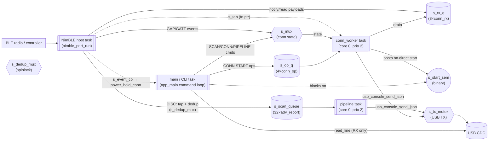
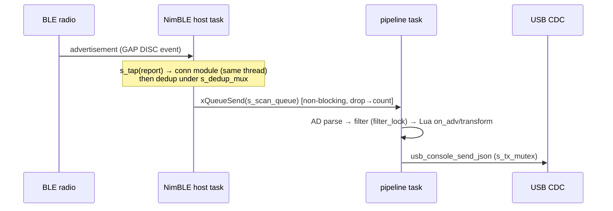
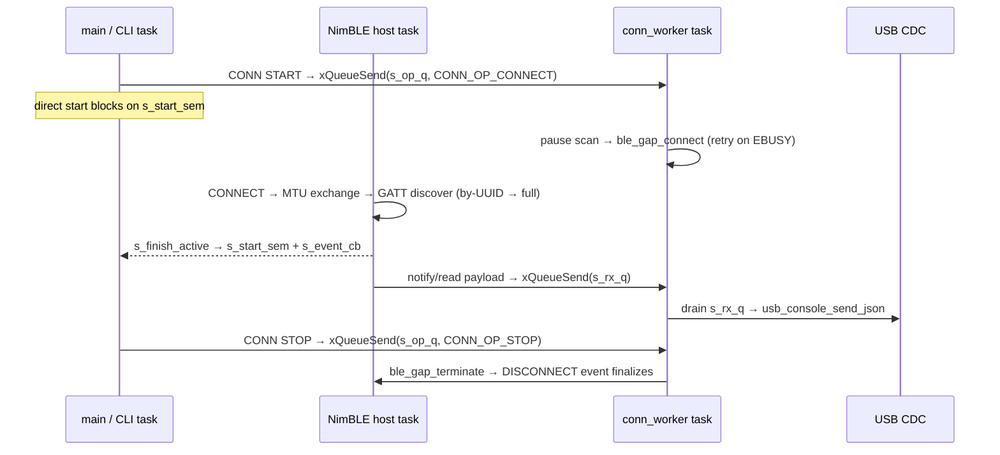

# ble — NimBLE scan, scan pipeline, and optional central-role connection

The BLE data plane: passive advertisement scanning → AD parse → C filters →
optional Lua hooks → JSON lines over USB CDC. With `CONFIG_BLE_CONN_ENABLED=y`
(F2.4), adds a single-peer GATT central connection that re-streams peer data as
`"src":"conn"` lines (analysis-only — conn lines deliberately bypass the Lua
hooks).

## Files

| File | Role |
|------|------|
| `ble_nimble_init.c` | NimBLE host init/teardown; starts the host task; host/controller sync handshake |
| `ble_scan.c` | Passive scan, dedup table, scan queue, and the F2.4 pause/tap seams |
| `scan_pipeline.c` | `pipeline` task: AD parse → filter → Lua hooks → JSON → USB |
| `ble_conn.c` | Central-role GATT client: connect/discover/subscribe/poll, `conn_worker` task |

Public API in `interfaces/ble_if.h`; error ranges in that header.

## Thread model

Four FreeRTOS tasks pass work through queues and guard shared state with
mutexes / a spinlock / atomics. NimBLE forces everything BLE-related onto a
single **host task**; two worker tasks (pipeline, conn) drain queues and format
JSON; the **main task** is the CLI/control thread.



### Tasks

| Task | Created where | Role | What it does |
|---|---|---|---|
| **`main` / CLI** | `app_main()` (main.c) | control + init | `while(1)` reads a USB line → `cli_process_command` → calls `ble_scan_*`, `pipeline_*`, `ble_conn_*`. Direct `CONN START` **blocks** here on `s_start_sem`. |
| **NimBLE host task** | `nimble_port_freertos_init()` in `ble_nimble_init.c` | all BLE events | Runs `nimble_port_run()`. Every GAP/GATT callback runs here — scan `DISC`, connect/disconnect, notify, GATT discovery. Serializes all BLE I/O onto one thread. |
| **`pipeline`** | `pipeline_init()` in `scan_pipeline.c` | adv consumer | Blocks on `s_scan_queue`; AD-parse → filter → Lua hooks → JSON → USB. Idles when `s_running` is false. |
| **`conn_worker`** | `ble_conn_init()` in `ble_conn.c` | conn owner | Drains `s_op_q` (CONNECT/STOP/DISC_NOTICE) and `s_rx_q` (payloads); runs the blocking connect sequence, poll fallback, and USB TX. |

There is **no separate USB task** — USB is synchronous stdio (`getchar`/`printf`);
TX is serialized by `s_tx_mutex`, RX is read only by `main`.

### Synchronization primitives

| Object | Type | Writer → Reader / guarded by | Purpose |
|---|---|---|---|
| `s_scan_queue` | queue (32) | host → pipeline | raw `adv_report_raw_t` handoff |
| `s_dedup_mux` | `portMUX` spinlock | host + main | dedup table (check in host; clear on `ble_scan_start`) |
| `s_scanning`, `s_paused` | `atomic_bool` | host/main/conn | scan state flags |
| `s_tap` | fn ptr | host → conn module | pre-dedup raw report tap for auto-connect |
| `s_mux` | mutex | all conn state | single lock guarding the whole `ble_conn` state block |
| `s_op_q` | queue (4) | main + tap → conn_worker | connect/stop/notice commands |
| `s_rx_q` | queue (8) | host → conn_worker | notify/read payloads |
| `s_start_sem` | binary sem | conn_worker → main | direct-start completion handshake |
| `s_event_cb` | fn ptr | host → main (`power_hold_conn`) | link up/down → power hold |
| `s_tx_mutex` | mutex | pipeline + conn_worker + main | serialize USB TX |
| `s_running` | `atomic_bool` | main → pipeline | pipeline gate |
| `s_sync_event_group` | event group | host → `ble_init` | host/controller sync at boot |

## Data paths and the single GAP slot

**Advertisement path** (scan):
`radio → host task (DISC) → tap + dedup → s_scan_queue → pipeline → AD parse → filter → Lua → JSON → USB`.

**Connection path**:
`radio → host task (GAP/GATT events) → s_rx_q → conn_worker → JSON → USB`.
Conn data deliberately **bypasses** the pipeline and Lua hooks.

**Coexistence seam**: NimBLE runs **one GAP procedure at a time**, so
`ble_gap_connect()` returns `EBUSY` while a scan discovery is active. The conn
worker calls `ble_scan_pause()` around the connect attempt and
`ble_scan_resume()` once the link is up or fails (`s_scan_paused`/`s_paused` +
the `DISC_COMPLETE` guard) — the user's scan is only ever paused for the
duration of the handshake.

## Connection state machine

```
off ──CONN START(auto)──▶ peer_search ──match──▶ connecting ──CONNECT ok──▶ discovering ──CCCD/read──▶ active
 │        ▲                    │                    │                           │                    │
 └────────┴────────────────────┴──timeout / cancel──┴──discovery fail───────────┴────disconnect───────┘
```

States are `ble_conn_state_t` in `interfaces/ble_if.h`; observable via
`CONN STATUS`.

## Sequence view (flows over time)

The flowchart above shows *who connects to whom*; the sequence view shows the
*order* of handoffs. Thread boundaries are crossed only via queues/semaphores;
everything else is a synchronous call within one task.

**Advertisement path** — the `s_tap` fires in the host task (same thread) before
dedup, so the conn feature sees every report:



**Connection + command path** — `CONN START` posts an op and (for direct starts)
blocks on `s_start_sem` until the host task finishes discovery:



## Shared-object access matrix

The same model from a different angle: which task touches which object, and how.
Legend — **W** write, **R** read, **P** post, **T** take/wait.

| Shared object | `main` | host task | `pipeline` | `conn_worker` | Guard |
|---|---|---|---|---|---|
| `s_scan_queue` | reset | P | T | — | FreeRTOS queue |
| `s_dedup` table | clear | R/W | — | — | `s_dedup_mux` (spinlock) |
| `s_scanning`, `s_paused` | W | R/W | — | R | `atomic_bool` |
| `s_tap` | — | call | — | (registered at init) | set-once |
| `s_mux` (conn state) | W | W | — | W | mutex |
| `s_op_q` | P | P (tap/notice) | — | T | queue (depth 4) |
| `s_rx_q` | — | P | — | T | queue (depth 8) |
| `s_start_sem` | T | — | — | P | binary sem |
| `s_tx_mutex` | W | — | W | W | mutex |
| `s_running` | W | — | R | — | `atomic_bool` |

Note the layering invariant from the module comment in `ble_conn.c`: **the host
task only copies data and pushes to queues** — it never formats JSON or touches
USB. JSON/USB live exclusively in the two worker tasks; `main` only issues
commands and reads status.

## Error codes (summary)

| Range | Module |
|-------|--------|
| `-6` / `-7` | BLE init: not initialized / already initialized |
| `-401`, `-402`, `-406`, `-411` | scan: invalid param / null ptr / not initialized / invalid state |
| `-450` … `-457` | conn: invalid param / not enabled / invalid state / not connected / discovery / timeout / no target / interrupted |
| `-802`, `-806`, `-811` | pipeline: null ptr / not initialized / invalid state |

See `interfaces/ble_if.h` for the named constants.
